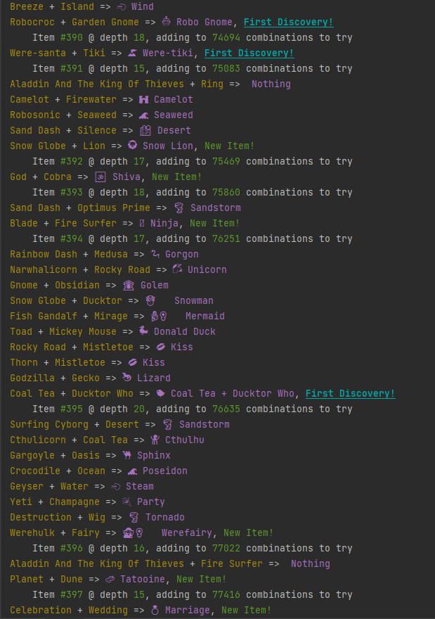
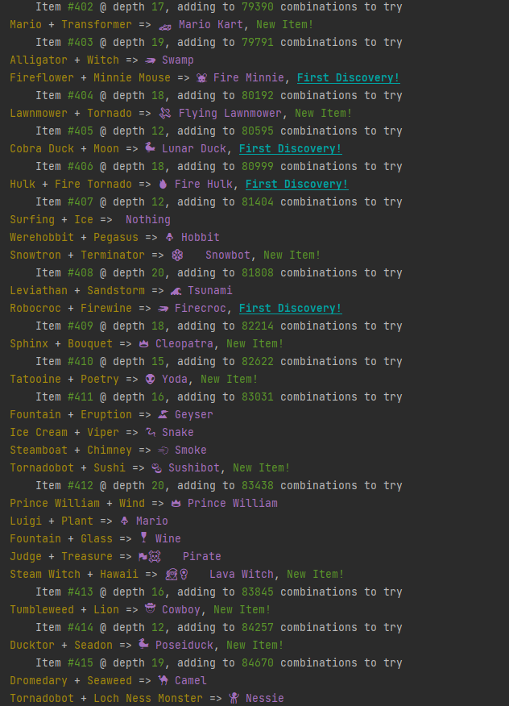

# Infinite Crafter

Infinite Crafter is a Python-based solution to [neal.fun's Infinite Craft](https://neal.fun/infinite-craft/). It systematically tries every possible combination of items available in the game, pushing the supposedly infinite boundaries of the game's LLM item generation. The application logs discoveries in a colored console, manages auto-updating save files, and handles the backend API interactions.

## Usage

Install Python3 dependencies:
```bash
pip install requests
```

Run the script with Python from the terminal or command prompt:
```bash
python solver.py
```

## Configuration
By default, the script runs with the save filenames `creation_tree.json`, `to_try.txt`, and `first_discoveries.txt`, and without any delay between requests. To edit these settings, change their corresponding constants at the beginning of the script:
```python
# save files
CREATION_TREE = 'creation_tree.json'
TRIED = 'tried.txt'
FIRST_DISCOVERIES = 'first_discoveries.txt'

DELAY = None  # optional delay between requests, in seconds
```

Each save file serves a different purpose. They will be created automatically on first run, and will be updated each time after. The save files are as follows:
- **CREATION_TREE:** Stores the creation tree of all item combinations and outcomes.
```json
{
  "Mountain": [
    "Earth",
    "Earth"
  ],
  "Eruption": [
    "Volcano",
    "Wind"
  ],
  "Manatee": [
    "Sea Cow",
    "Coral"
  ],
  "Ghost Whale": [
    "Whale Ice Cream",
    "Ghost"
  ]
}
```
- **TRIED:** Keeps track of item combinations that we have already tried
```txt
Fireman	Twilight
Gnome	Crocodile
Ducktor	Flaming Drink
Sea Serpent	Shiva
Chimera	Moana
```
- **FIRST_DISCOVERIES:** Logs the first-time discoveries with timestamps.
```txt
2024-02-07 15:34:45.516644 	->	 Titanic 2: Wolverine
2024-02-07 15:34:55.557367 	->	 Gnomatron 9 Deluxe
2024-02-07 15:35:39.175861 	->	 Bald Genie
2024-02-07 15:36:23.421525 	->	 Polar Tornadobot
2024-02-07 15:37:34.888740 	->	 Duckcow
2024-02-14 10:40:31.535035 	->	 Crash Were-tiki
2024-02-14 10:41:46.735940 	->	 Darth Gnomius
```

## Screenshots



## TODO
- Add a "turbo mode" to allow for concurrent requests, speed configurable.
- Make a system to easily import `CREATION_TREE` into the site's local storage system `infinite-craft-data`.
- Convert `CREATION_TREE`'s json system into an appendable text file system, to avoid rewriting the entire file each time.
- Analyze combination patterns to predict future combinations. This could lead to trial optimizations, e.g. combining items with its own parents may not be fruitful.

## Disclaimer

This script is intended for educational purposes only, please adhere to Infinite Craft's TOS.
